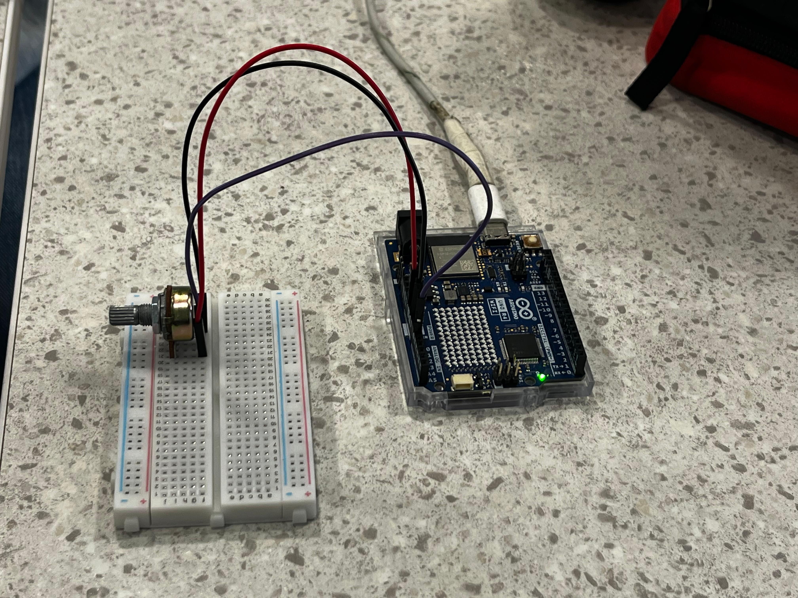
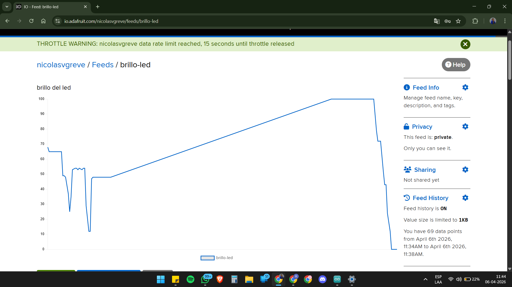
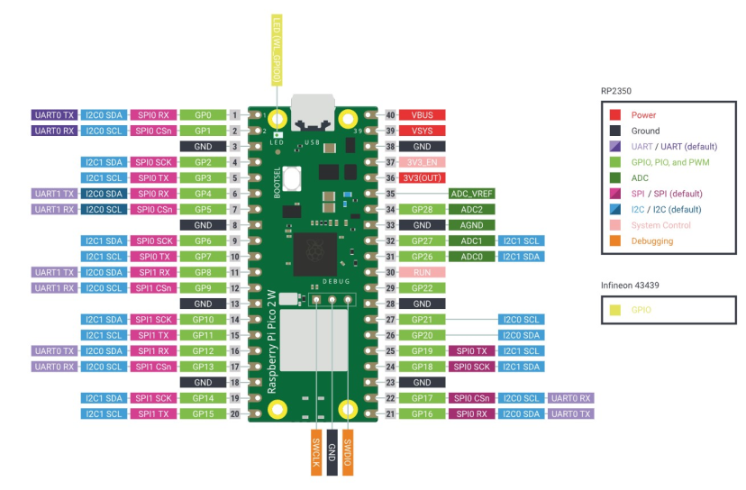
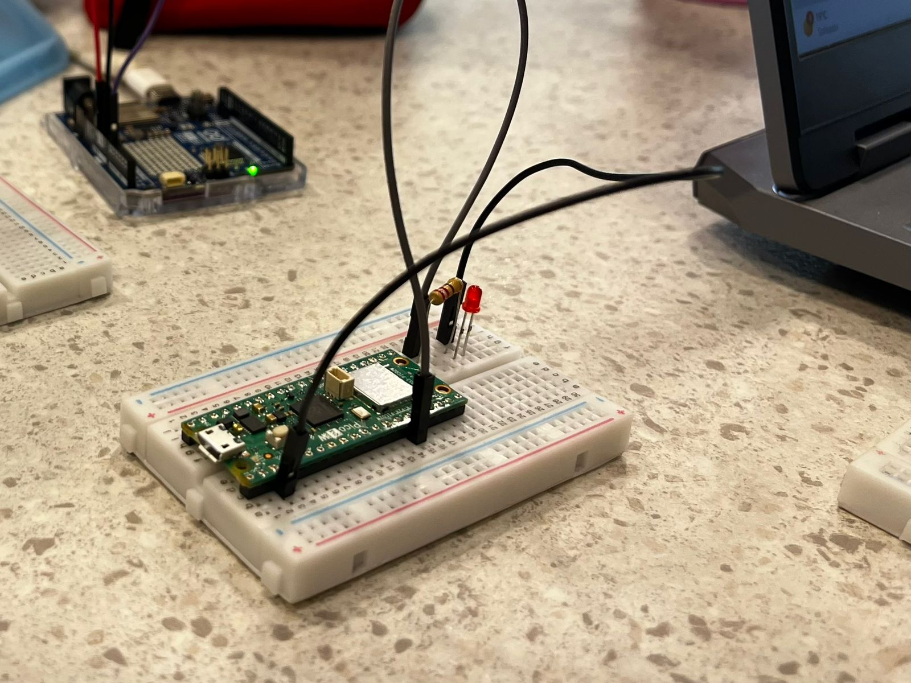
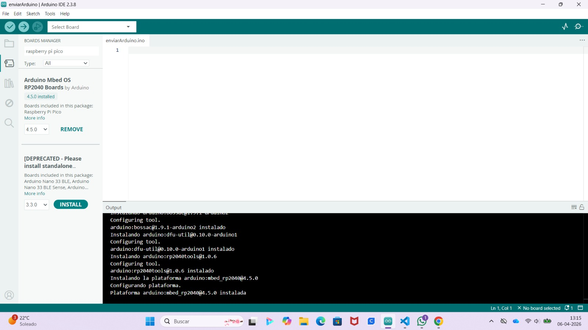
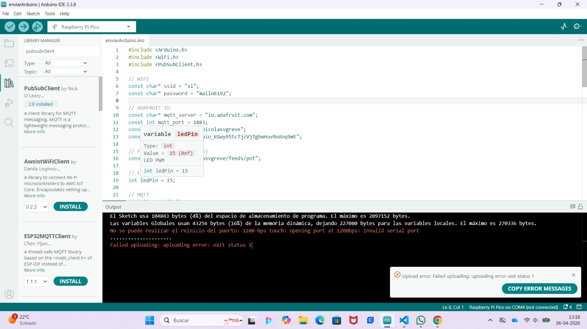
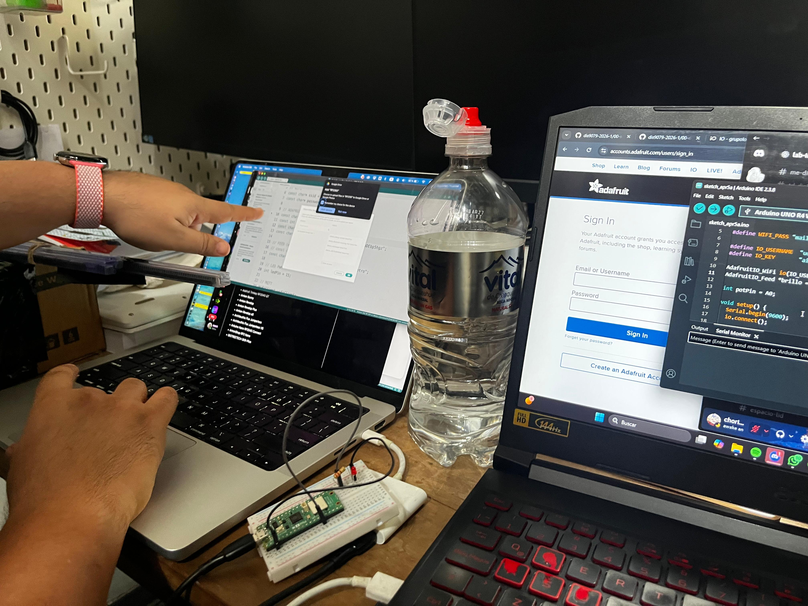
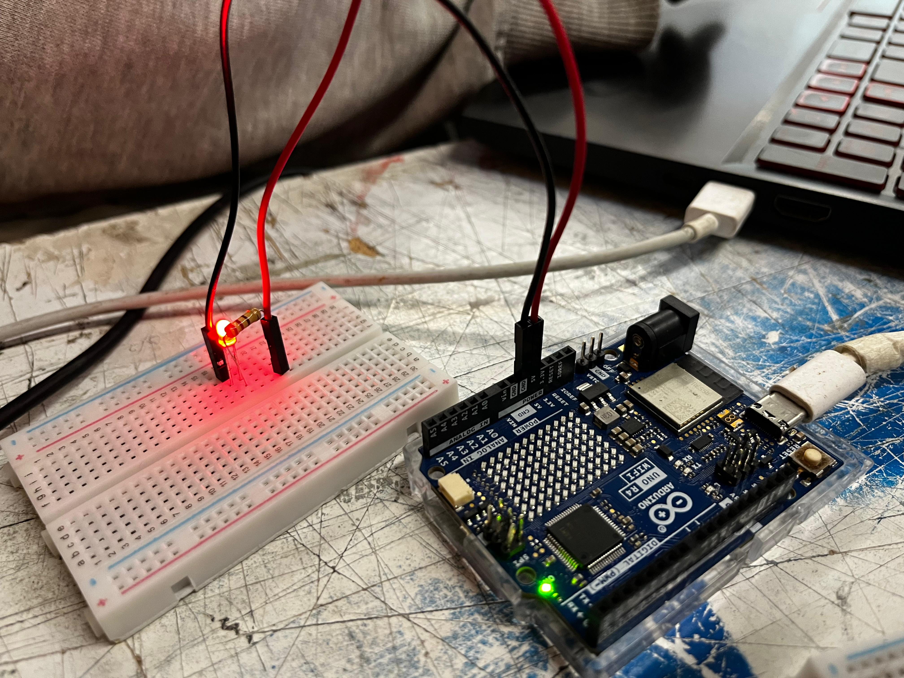
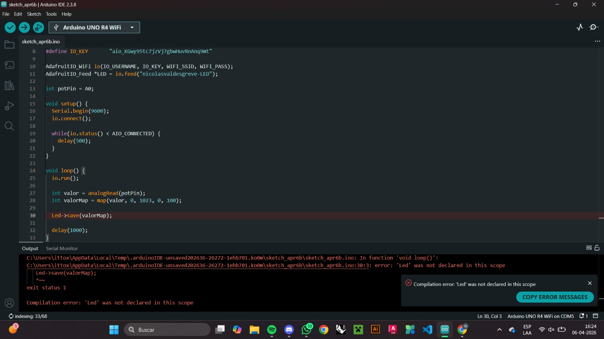
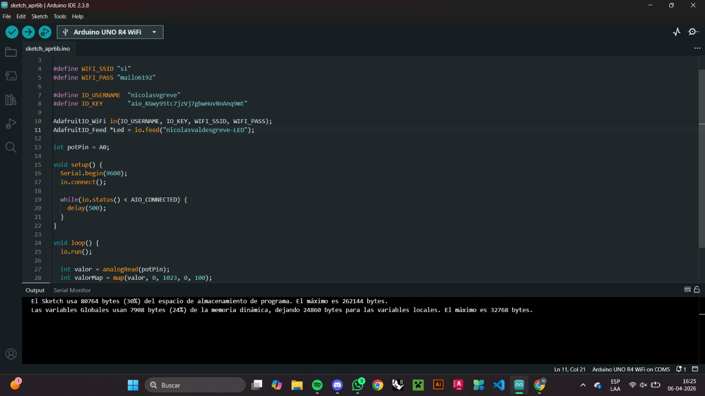

# Grupo-06

## Integrantes

* Renata De Los Ángeles Arévalo Urra / <https://github.com/arevalourra/dis9079-2026-1/tree/main/06-arevalourra>
* Isidora Andrea Pérez Maulén / <https://github.com/arevalourra/dis9079-2026-1/tree/main/21-isipm08>
* Nicolás Elías Valdés Greve / <https://github.com/arevalourra/dis9079-2026-1/tree/main/29-nicolasvaldesgreve>

---

## Descripción del proyecto

El proyecto que realizaremos consiste en la comunicación entre dos placas (Arduino Uno R4 Wifi - Raspberry Pi Pico 2W) conectadas a distintos computadores mediante internet (llamado "si"), utilizando Adafruit IO como intermediario. La idea principal de nuestro proyecto es enviar información desde un dispositivo físico y representarla en otro en tiempo real. 

En este caso, los componentes que utilizamos son:
+ Potenciómetro conectado a Arduino Uno R4 Wifi, el cual envía valores a la nube.
+ LED
+ Resistencia de 220 Ω
+ Cables Dupont para formar la conexión entre las placas y componentes
  
---

## Sistema Enviar

Primero iniciamos probando el conectar el Arduino UNO R4 WiFi a un potenciómetro y que éste mande información a Adafruit, por lo que conectamos la placa Arduino al potenciómetro mediante cables Dupont, teniendo las siguientes conexiones:

+ GND - Pata izquierda del potenciómetro (conexión hecha con cable de color negro)
+ A0 - Pata del medio del potenciómetro (conexión hecha con cable de color morado)
+ 5V - Para derecha del potenciómetro (conexión hecha con cable de color roja)

Luego de conectar el potenciómetro al Arduino, así se veía nuestra protoboard:



Como ya teníamos la placa y el potenciómetro listos, solo nos faltaba lograr enviar la información del movimiento del potenciómetro al Adafruit IO, por lo que fuimos a Feeds y creamos un feed llamado ``brillo-led`` ya que en ese momento estabamos pensando en hacer que el movimiento del potenciómetro afecte el brillo de un LED. Luego de crear el feed, fuimos a crear una nueva Dashboard en donde presionamos en Add Block y generamos un block de ``Gauge``, el cual va de 0 a 100. A éste block le asignamos el feed ``brillo-led`` y cuando subimos el código en Arduino IDE logramos ver como éste se conectaba a Adafruit IO y nos mostraba el cambio de valor al mover el potenciómetro que estaba conectado a la placa Arduino.


Luego, si presionábamos en el feed de ``brillo-led``, nos permitía ver un gráfico que representaba toda la información que le enviábamos desde el potenciómetro, lo cual se veía así:



---

## Sistema Recibir

Como nuestra idea era poder controlar el brillo del LED de una placa a otra, decidimos que en la Raspberry iría el LED ya que en ya habíamos logrado conectar el potenciómetro al Arduino. Como no sabíamos como hacer conexiones con ésta placa y no entendímos los textos que habían en ella, tuvimos que buscar imagenes de referencia para poder reconocer los Pins de la placa y para qué sirve cada una, por lo que encontramos ésta imagen:



Luego de tratar de entender cómo leer los pins y qué hace cada uno, ubicamos una resistencia de 220 y un LED rojo a nuestra protoboard junto a la placa Raspberry Pi Pico 2 W, lo cual terminó viendose así:



Cuando íbamos a correr el código en Arduino IDE nos dimos cuenta que para poder trabajar con una Raspberry Pi hay que instalar bibliotecas extra, por lo que instalamos la extensión de Raspberry Pi Boards.



Cuando por fin subimos el código, nos salió un error en donde se menciona un puerto serial y por lo que buscamos en internet esto suele pasar bastante con las placas Raspberry Pi, pero a pesar de eso seguimos intentando, y cuando nos dimos cuenta de que ya llevábamos horas en eso decidimos buscar ayuda en el Laboratorio de Interacción Digital (LID).



---

## Aarón nos ayuda en el LID

Como no logramos solucionar el error del puerto, fuimos al LID a ver si alguien nos podía ayudar y nos encontramos a Aarón, por lo que le pedimos revisar cuál era el problema. Cuando le explicamos el problema, pidió ver primero el código que envía ya que eso era lo primero que teníamos que hacer funcionar, por lo que le mostramos lo que teníamos en Arduino IDE y nos corrigió el Key de Adafruit IO para que se pueda conectar bien, y aparte cambió el nombre del Feed a algo más formal que en este caso fue ``nicolasvaldesgreve-potenciador``, ya que así es más fácil identificar a la persona por el nombre de Github.



Luego conversar por un rato, llegamos a la conclusión de que en vez de usar un Raspberry Pi Pico 2 W podíamos usar otra Arduino UNO R4 WiFi, lo cual no sabíamos que era una opción pero nos alivió mucho ya que usar la Raspberry era un poco complicado tanto en Arduino IDE como en Visual Studio Code.

---

## Prueba LED en sistema recibir

Para probar si respondía el Adafruit IO al LED con el código, unimos un LED junto a una resistencia de 220 Ω a la placa Arduino mediante cables Dupont, lo cual terminó viendose así:



Luego de tener listo el circuito, añadimos un Feed llamado ``brillo-led`` el cual era para poder manejar la luz del LED mediante Adafruit IO. Dentro del Dashboard se creó un block de ``Togle`` al cual se le asignó el feed de ``brillo-led``, el cual se esperaba que pudiera apagar y encender la luz del LED que estaba conectado a la placa. Al correr el código pasó ésto: 


Como se puede ver en el gif, no pasó nada. Cuando vimos que el LED no reaccionaba, revisamos el código y nos dimos cuenta de lo siguiente:



Nos tiraba error ya que el "led" no estaba declarado, por lo que corregimos eso y subimos nuevamente el código por lo que quedó así:



Al correr nuevamente el código no salió ningún error pero solo salía que estaba conectando a Adafruit y aparecían muchos puntitos, por lo que nunca logró conectarse en realidad.

---

## Materiales usados en Solemne-01

| Componente | Cantidad | Valor Unidad | Link |
| --- | --- | --- | --- |
| Protoboard 400 puntos | 2 | $2.100 | <https://prodelab.cl/productos/didacticos/nivel-superior-y-ensenanza-media/robotica-y-programacion/accesorios-robotica-y-programacion/protoboard-breadboard-400-pines/?utm_source=Google%20Shopping&utm_campaign=Google%20Shopping&utm_medium=cpc&utm_term=adtribes&srsltid=AfmBOooQXrc0i240CS5O9AUC5AUSqcPz3Hrk2lJyRK-PgMDmejZeipjTcFg>
| Potenciómetro Lineal B100k | 1 | $495 | <https://altronics.cl/potenciometro-lineal-100k-b100k> |
| Diodo LED | 1 | $70 | <https://afel.cl/products/diodo-led-5mm-ultrabrillante-rojo?srsltid=AfmBOoqRs9WauSkvkWECyOR_iyVpwsim5QBZGM6EE1L0-aXGRZKD_1eJ> |
| Resistencia 220 | 1 | $413 | <https://altronics.cl/pack-10-resistencias-220ohm-025watt-1porciento> |
| Cables Dupont (Pack 40 uni.) | 1 | $2.590 | <https://mcielectronics.cl/shop/product/cable-dupont-macho-macho-20cm-pack-40-unidades/?srsltid=AfmBOooI8-36HQsjC83sDGqLy-uZ_ht-tuw0nwyKZnloJfamdRdmCWYI> |
| Arduino UNO R4 WiFi | 1 | $38.990 | <https://arduino.cl/producto/arduino-uno-r4-wifi/?srsltid=AfmBOopJcCsivMRX00i4ZKVCJATlhSM2Bc6SCRhEdXzw6r1x08Ui9740> |
| Raspberry Pi Pico 2 W | 1 | $14.990 | <https://raspberrypi.cl/products/raspberry-pi-pico-2-w-con-headers> |

## Código usado con Adafruit IO

### Código para enviar

```cpp
#include <WiFiS3.h>
#include "AdafruitIO_WiFi.h"

// nombre wifi y contraseña
#define WIFI_SSID "si"
#define WIFI_PASS "mailo6192"

//credenciales Adafruit IO
#define IO_USERNAME  "UserDeAdafruit"
#define IO_KEY       "KeyDeAdafruit"

//aquí va la variable con el nombre del feed
AdafruitIO_WiFi io(IO_USERNAME, IO_KEY, WIFI_SSID, WIFI_PASS);
AdafruitIO_Feed *potenciometro = io.feed("nicolasvaldesgreve-potenciometro");

int potPin = A0;

void setup() {

  //la velocidad la dejamos de 9600 baud como el standard, prender monitor serial
  Serial.begin(9600);
  io.connect();

  while(io.status() < AIO_CONNECTED) {
    delay(500);
  }
}

void loop() {
  io.run();

  int valor = analogRead(potPin);
  int valorMap = map(valor, 0, 1023, 0, 100);

  potenciometro->save(valorMap);

  delay(1000);
}
```

### Código para recibir

```cpp
// rellenar
```

## Investigaciones Individuales

[persona-01.md](./persona-01.md)  - Renata Arévalo Urra

[persona-02.md](./persona-02.md) - Isidora Pérez Maulén

[persona-03.md](./persona-03.md) - Nicolás Valdés Greve

## bibliografía

Lista de enlaces, libros, clases, tutoriales, etc

+ <https://io.adafruit.com/nicolasvgreve/overview>, en donde explica cómo utilizar Arduino IDE en la sección inferior llamada ``Quick Guides``.
+ <https://mkelectronica.com/aprende-a-utilizar-la-plataforma-adafruit-io-para-tus-dispositivos-iot-parte-1/>, en donde se explica cómo funciona la plataforma de Adafruit IO incluyendo imagenes para que sea más fácil de entender.
