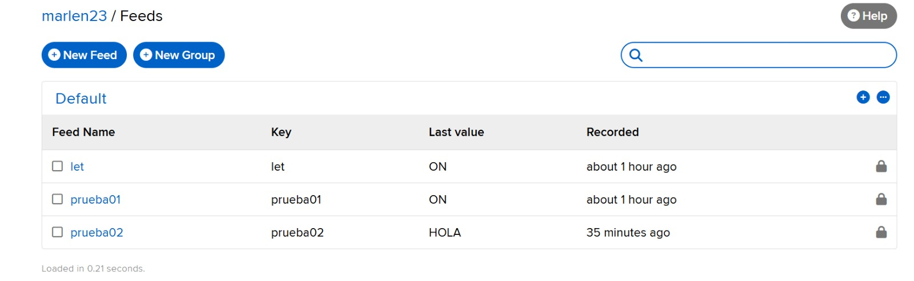
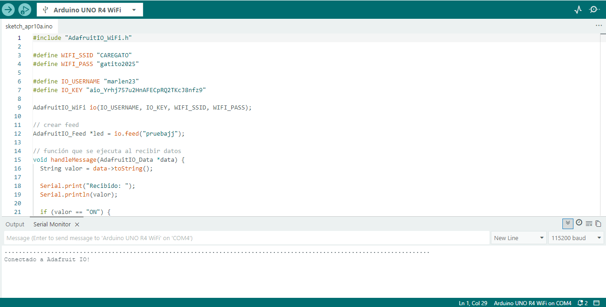
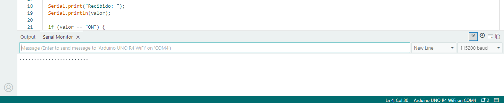
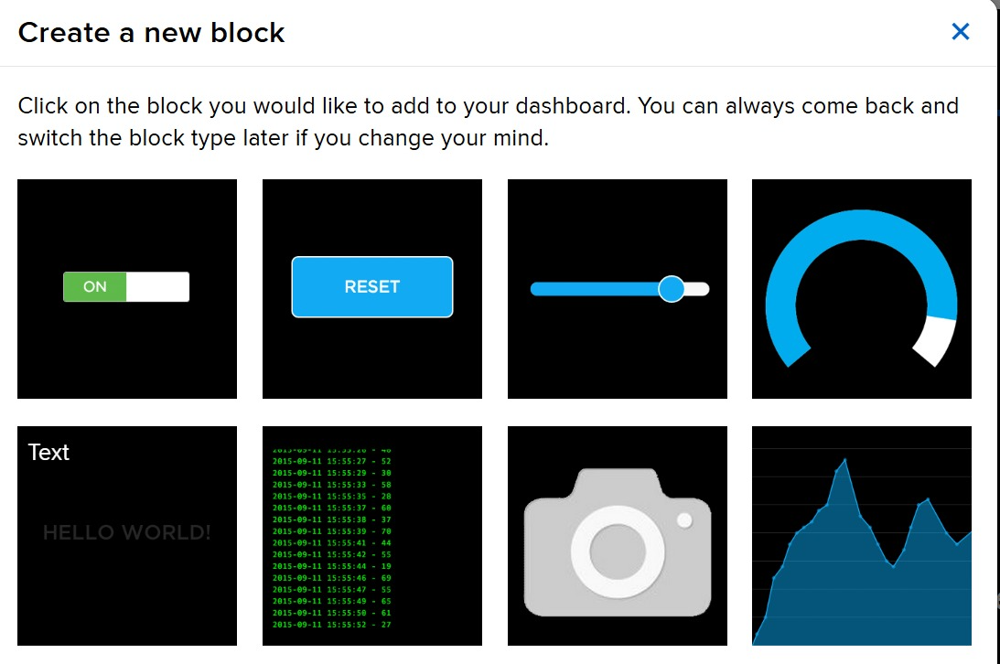
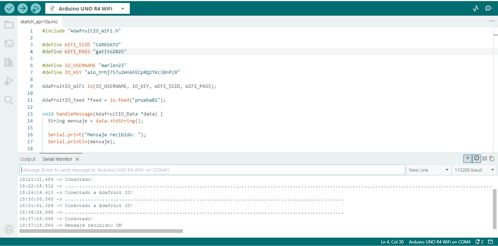

# grupo-09

## integrantes

• Marlén Soto Soto  
• Marcela Zúñiga

## descripción del proyecto

El proyecto consiste en crear un sistema de comunicación entre dispositivos electrónicos utilizando internet mediante la plataforma Adafruit IO. La idea es que los dispositivos puedan enviar y recibir información en tiempo real sin estar conectados físicamente entre sí.

En un inicio, se buscaba controlar un LED de la placa Arduino enviando comandos desde Adafruit (encender y apagar). Sin embargo, esta funcionalidad no se logró implementar correctamente, ya que el Arduino no respondía de forma consistente a los mensajes “ON” y “OFF”.

Por esta razón, se optó por trabajar con el envío y recepción de texto. A través de un feed tipo “text” en Adafruit IO, se logró enviar mensajes desde la plataforma y recibirlos en el Arduino, donde se visualizaron en el monitor serial. De esta manera, se pudo demostrar la comunicación a través de internet, cumpliendo parcialmente el objetivo del proyecto.

## materiales usados en solemne-01

## Materiales

| Material              | Cantidad | Descripción                          | Valor aproximado |
|----------------------|----------|--------------------------------------|------------------|
| Arduino UNO R4 WiFi  | 1        | Placa principal con conectividad WiFi| $30.000 CLP      |
| Cable USB tipo A     | 1        | Conexión entre Arduino y computador  | $3.000 CLP       |

## código usado con Adafruit IO

### código para enviar

Creamos diferentes feeds y dashboards en Adafruit IO, en donde, a base de pruebas y errores, logramos que el Arduino pudiera recibir un mensaje.




## proceso

El día lunes 06 fuimos los últimos en lograr conectarnos a Adafruit. Después de varios intentos, finalmente lo conseguimos. Inicialmente tuvimos problemas con la velocidad de conexión, lo que nos impedía visualizar correctamente en qué estado se encontraba el proceso. Con la ayuda de Aaron, decidimos cerrar Arduino y volver a abrirlo. Tras hacer esto, el sistema funcionó correctamente, aunque demoró un poco en cargar.

Para continuar con la solemne, intentamos utilizar un toggle en Adafruit, el cual, al encenderse y apagarse, debía controlar los LED del Arduino. Sin embargo, a pesar de modificar el código en múltiples ocasiones, no logramos que funcionara. Estuvimos aproximadamente dos horas intentando que el Arduino recibiera la información, pero no obtuvimos resultados.



Además, cometimos algunos errores en el código. Por ejemplo, en la contraseña del WiFi habíamos escrito mal la última letra, lo que impedía la conexión. Debido a esto, el sistema quedaba intentando conectarse sin éxito y solo mostraba puntos en la carga.



Al final, buscamos otra forma de enviar y recibir información. Para esto, en Adafruit agregamos un nuevo bloque de tipo “text”.



A partir de esto, trabajamos con otro código que fuimos ajustando hasta que finalmente logramos recibir datos en el Arduino. Marlen se encargó de enviar la información desde Adafruit y Marcela de recibirla desde el Arduino. Sin embargo, solo logramos recibir un mensaje, “ON”. Intentamos enviar también un “OFF”, pero este nunca llegó. Aun así, seguiremos ajustando el código, ya que estamos muy contentos de haber logrado al menos la recepción de un dato.



<https://github.com/user-attachments/assets/cc8b1825-d7d3-46d0-aa7d-2ac7c3fd2a4d>

También queremos mencionar que, al parecer, debido al internet, muchas veces no logramos conectarnos a Adafruit y el sistema quedaba cargando. En esos casos teníamos que desconectar y volver a conectar el Arduino, además de tener paciencia hasta que se reconectara nuevamente. Al principio nos asustamos, ya que estábamos usando el mismo código que antes sí funcionaba, pero dejó de conectar. Sin embargo, al final nos dimos cuenta de que el problema probablemente era solo la conexión a internet.

### código para recibir

```cpp
// Librería para conectar Arduino a Adafruit IO vía WiFi
#include "AdafruitIO_WiFi.h"

// Credenciales de tu red WiFi
#define WIFI_SSID "bla"
#define WIFI_PASS "bla"

// Credenciales de Adafruit IO
#define IO_USERNAME "bla"
#define IO_KEY "bla"

// Crear objeto de conexión
AdafruitIO_WiFi io(IO_USERNAME, IO_KEY, WIFI_SSID, WIFI_PASS);

// Crear feed (canal) llamado "prueba02"
AdafruitIO_Feed *feed = io.feed("prueba02");

// Función que se ejecuta cuando llega un mensaje desde Adafruit
void handleMessage(AdafruitIO_Data *data) {
  // Convertimos el dato recibido a texto
  String mensaje = data->toString();

  // Mostramos el mensaje en el monitor serial
  Serial.print("Mensaje recibido: ");
  Serial.println(mensaje);

  // Si el mensaje es "ON", encendemos el LED
  if (mensaje == "ON") {
    digitalWrite(LED_BUILTIN, HIGH);
  }
  // Si el mensaje es "OFF", apagamos el LED
  else if (mensaje == "OFF") {
    digitalWrite(LED_BUILTIN, LOW);
  }
}

void setup() {
  // Iniciamos comunicación serial
  Serial.begin(115200);

  // Configuramos el LED integrado como salida
  pinMode(LED_BUILTIN, OUTPUT);

  // Conectarse a Adafruit IO
  io.connect();

  // Esperar hasta que se conecte
  while (io.status() < AIO_CONNECTED) {
    Serial.print(".");
    delay(500);
  }

  // Mensaje de conexión exitosa
  Serial.println("\nConectado!");

  // Asociar la función que maneja los mensajes
  feed->onMessage(handleMessage);

  // Pedir el último valor guardado en el feed
  feed->get();
}

void loop() {
  // Mantiene la conexión activa y escucha mensajes
  io.run();

  // Pequeña pausa para estabilidad
  delay(100);  
}
```

## investigaciones individuales

rellenar en el mismo orden que los integrantes del grupo

[Marlen_Soto](./persona-01.md)
[Marcela_Zúñiga](./persona-02.md)
[persona-03.md](./persona-03.md)

## bibliografía

•Adafruit Industries. (s.f.). Adafruit IO Basics: Feeds. Recuperado de <https://learn.adafruit.com/adafruit-io-basics-feeds>

•Adafruit Industries. (s.f.). Adafruit IO Arduino. Recuperado de <https://learn.adafruit.com/adafruit-io/arduino>

•Arduino. (s.f.). Arduino Reference. Recuperado de <https://www.arduino.cc/reference/en/>

•Arduino. (s.f.). WiFi Library. Recuperado de <https://www.arduino.cc/en/Reference/WiFi>

•Adafruit Industries. (s.f.). Adafruit IO Arduino Library. Recuperado de <https://github.com/adafruit/Adafruit_IO_Arduino>
