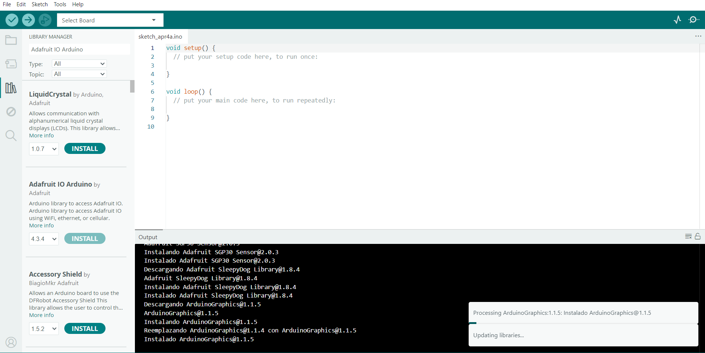

# persona-01:Marlen Soto

investigaciones individuales

## sobre adafruit i/o

### ¿Qué es Adafruit Industries?

Adafruit Industries es una empresa y comunidad tecnológica fundada en 2005 por Limor Fried. Su propósito es acercar la electrónica y la programación a personas de todas las edades, facilitando el aprendizaje de manera simple y didáctica.

Además, ofrece la plataforma Adafruit IO, la cual permite conectar dispositivos a internet para enviar, recibir, almacenar y visualizar datos en tiempo real.

---

### Componentes de Adafruit IO

* **Dashboard (tablero):** Interfaz visual donde se muestran y controlan los datos del proyecto.
* **Feed:** Canal donde se almacenan los datos enviados por los dispositivos; es la base del sistema.

---

### Funcionamiento básico

El proceso de funcionamiento es el siguiente:

1. Un dispositivo como Arduino detecta un evento mediante un sensor.
2. El dato es enviado a Adafruit IO.
3. La plataforma guarda la información en un **feed**.
4. El **dashboard** muestra los datos en tiempo real.

---

### Recursos disponibles

En la plataforma de Adafruit se pueden encontrar: https://learn.adafruit.com/welcome-to-adafruit-io/arduino-and-adafruit-io?

* Guías desde nivel básico hasta avanzado
* Proyectos con Arduino, sensores y pantallas
* Explicaciones claras de código y conexiones
* Ejemplos prácticos para desarrollar ideas propias

---

### Estructura del código

Para trabajar con Adafruit IO y Arduino, es fundamental especificar correctamente la biblioteca utilizada. En este caso, se emplea la biblioteca:

* **Adafruit IO Arduino**, utilizando el archivo de conexión WiFi **`AdafruitIO_WiFi.h`**.

Esta biblioteca permite establecer la conexión con la plataforma, gestionar feeds y enviar o recibir datos en tiempo real.

La organización del código suele ser:

* **Archivo `.ino`:** Contiene la lógica principal del programa, incluyendo la lectura de sensores y el envío de datos.
* **Archivo `config.h`:** Guarda las credenciales (usuario, clave y red WiFi), permitiendo mantener el código ordenado y seguro.

---

Proceso de instalación

Ingresas tus datos y tus correo institucional

Luego instalas en la biblioteca de arduino la versión mas nueva de adafruit que es la 4.3.4

## sobre artista, diseñadora o producto que usa electrónica o computación inalámbricas

**Mariko Mori** es una artista contemporánea japonesa reconocida internacionalmente por su trabajo en arte multidisciplinario, donde combina tecnología, espiritualidad y estética futurista. Su obra explora la relación entre el ser humano, el universo y la conciencia, integrando influencias del budismo, el sintoísmo y la cultura contemporánea.

Se enfoca en la conexión entre humanidad y tecnología: sus obras buscan generar experiencias inmersivas donde el espectador no solo observa, sino que participa y se conecta a nivel sensorial y espiritual.Mezcla de arte, ciencia, luz, sonido y entornos digitales.

Sus proyectos son visualmente impactantes y reflexivos: proponen ideas sobre la interconexión, la trascendencia y la unidad global.

Tipos de obras que hace
Instalaciones inmersivas: espacios interactivos donde el público vive una experiencia sensorial y espiritual.

Fotografía artística: autorretratos escenificados con estética futurista y cultural japonesa.

Escultura: objetos simbólicos con formas orgánicas y tecnológicas.

Arte digital: uso de tecnología, luz y programación para crear experiencias visuales.

Obras conocidas
Wave UFO → instalación interactiva que utiliza ondas cerebrales para generar visuales en tiempo real.
<https://www.digiart21.org/art/wave-ufo>

Play with Me → serie fotográfica que explora la identidad y la cultura de consumo.

Nirvana → obra inspirada en la iluminación y la espiritualidad budista.
<https://smarthistory.org/mariko-mori-pure-land/>

Dream Temple → instalación que mezcla arquitectura, tecnología y meditación <https://kyotojournal.org/culture-arts/synthetic-dreams-the-art-of-mariko-mori/>

## Reflexión desde el diseño

### La tecnología como medio de conexión, no solo como herramienta

Lo que más destaca en el trabajo de Mariko Mori es cómo la tecnología deja de ser un simple instrumento técnico y pasa a convertirse en un medio para generar conexión emocional y espiritual. No se trata solo de utilizar sensores, luz o programación, sino de crear experiencias donde el usuario se sienta parte de un sistema más amplio.

---

### Flujo de experiencia 

A diferencia de sistemas técnicos tradicionales, en su obra el flujo no es solo **input → procesamiento → output**, sino que se transforma en una experiencia sensorial completa.

Por ejemplo, en *Wave UFO*, el input (ondas cerebrales) se procesa y se traduce en una respuesta visual que permite al usuario percibir su propio estado interno. Esto amplía la lógica de plataformas como Adafruit IO hacia una dimensión más experiencial.

---

### Diseño de la interacción

El valor del proyecto no está en un resultado final tangible, sino en el diseño del sistema de interacción. El usuario no solo observa, sino que participa activamente.

Esto plantea que, en el diseño digital, el desafío no es solo técnico, sino también conceptual: lograr que la interacción sea fluida, intuitiva y significativa.

---

### Interfaz entre lo físico y lo digital

Uno de los aspectos más relevantes es cómo la tecnología se vuelve casi invisible. La interfaz no es evidente, sino que se integra completamente en la experiencia.

Esto sugiere que el objetivo del diseño no es mostrar la tecnología, sino hacer que funcione de manera natural, generando una conexión directa entre el usuario y el sistema.

---

## Conclusión

El trabajo de Mariko Mori demuestra que la tecnología puede ir más allá de su función instrumental, convirtiéndose en un medio para generar experiencias sensoriales, emocionales y reflexivas. Desde el diseño, esto amplía los límites tradicionales, integrando lo digital, lo físico y lo humano en una sola experiencia.

---

## Bibliografia
Adafruit Industries. (s.f.). Adafruit IO Arduino. Adafruit Learning System. https://learn.adafruit.com/adafruit-io/arduino

Adafruit Industries. (s.f.). Adafruit IO Arduino library. GitHub. https://github.com/adafruit/Adafruit_IO_Arduino

Adafruit Industries. (s.f.). Adafruit IO basics: Feeds. Adafruit Learning System. https://learn.adafruit.com/adafruit-io-basics-feeds

Arduino. (s.f.). Arduino reference. https://www.arduino.cc/reference/en/
