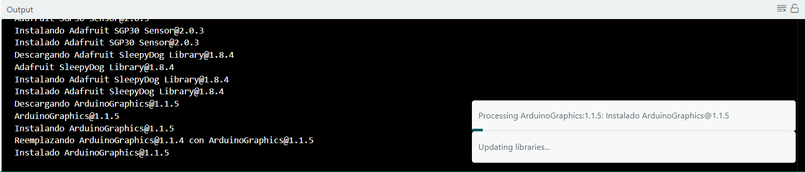
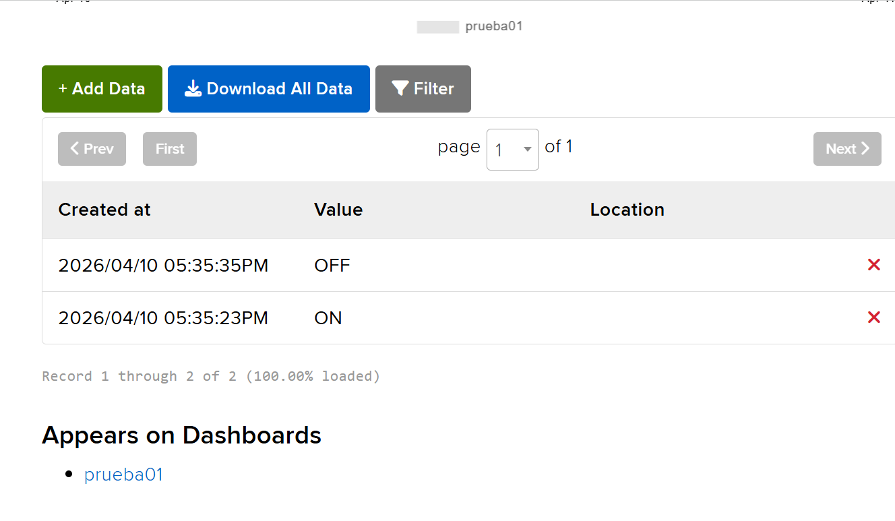

# persona-02: Marcela Zúñiga

integradas mas abajo

## sobre adafruit i/o

Configuración de software: Tuvimos que instalar la librería de Adafruit dentro del programa Arduino IDE. Esto fue clave para poder vincular nuestra placa Arduino Uno R4 con la red WiFi y conectarla con la nube.  

  

  

Armado del entorno: En la plataforma web de Adafruit IO, creamos nuestro canal de datos (llamado "prueba01") y configuramos el Dashboard. Inicialmente intentamos usar un bloque de tipo "Toggle" (un interruptor de encendido/apagado visual), pero tras varios problemas, terminamos configurando un bloque de tipo "Text" para enviar las instrucciones.

  

### Dificultades encontradas

Errores de tipeo en credenciales: Al principio el sistema no lograba conectarse a la red y el monitor serie se quedaba en un bucle  mostrando puros puntitos (...). Revisando, nos dimos cuenta de un error súper simple: habíamos escrito mal la última letra de la contraseña del WiFi.

Falla en la interfaz gráfica (Toggle): Estuvimos aproximadamente dos horas intentando que el bloque Toggle encendiera y apagara los LEDs del Arduino. Modificamos el código muchísimas veces, pero no logramos que el Arduino recibiera la información, por lo que tuvimos que cambiar de proceso.

### Aprendizaje

Logro del objetivo: Logramos que el Arduino recibiera exitosamente el mensaje "ON". Aunque intentamos mandar un "OFF" y este nunca llegó, nos quedamos súper contentas de haber logrado, al menos, la recepción de un dato de forma inalámbrica.

Conexión digital-físico: Entendí en la práctica la lógica, fue súper interesante ver cómo una interfaz web que opera netamente en una pantalla sirve como puente directo para mandar instrucciones a un objeto físico a distancia.

## sobre artista, diseñadora o producto que usa electrónica o computación inalámbricas

Artista/Diseñadora investigada: Sougwen Chung  
Proyecto: Drawing Operations Unit Generation (DOUG)  

### Descripción del proyecto y uso de tecnología

Sougwen Chung es una artista y diseñadora que explora la colaboración entre humanos y máquinas. En su proyecto DOUG, utiliza un brazo robótico que dibuja simultáneamente junto a ella en el mismo lienzo. Para lograr esto, utiliza cámaras y sensores que capturan sus movimientos y biométricas en tiempo real. Esta información se procesa a través de un software basado en redes neuronales (Inteligencia Artificial) y los datos resultantes se transmiten de forma inalámbrica al hardware del brazo robótico. El robot recibe estos paquetes de datos al instante y responde físicamente, imitando, complementando o reaccionando a los trazos de la diseñadora.

### Reflexión y análisis desde el diseño

La máquina como colaboradora, no como herramienta: Lo que más me llama la atención de este proyecto es el cambio de paradigma. En diseño solemos ver la electrónica y el software como herramientas de ejecución exacta (como mandar a imprimir o cortar algo). Sin embargo, al utilizar comunicación inalámbrica y procesamiento de datos en tiempo real, Chung convierte al hardware en un ente interactivo que tiene su propio comportamiento.

Flujo de información: Este referente me sirve mucho para entender a gran escala lo que estamos viendo con plataformas como Adafruit. Existe un input (los sensores leyendo el movimiento de la artista), un procesamiento de datos (el software interpretando esa información), y una comunicación inalámbrica que envía la instrucción a un output físico (los motores del brazo robótico).

El diseño de la interacción: El valor de este proyecto no está en el dibujo final, sino en el diseño del sistema de comunicación entre los dispositivos. Me hace pensar en que, al trabajar con electrónica inalámbrica, el desafío real del diseño digital es lograr que esa transferencia de datos sea fluida y tenga sentido para el usuario, logrando que la interfaz entre el mundo físico y el digital sea casi imperceptible.

  

### Bibliografía

• Sougwen Chung. (s.f.). Drawing Operations Unit Generation (DOUG). Recuperado de: https://sougwen.com  

• Ars Electronica. (s.f.). Sougwen Chung: Drawing Operations. Recuperado de: https://ars.electronica.art  

• MIT Media Lab. (s.f.). Human-Machine Interaction and Creative Systems. Recuperado de: https://www.media.mit.edu  
