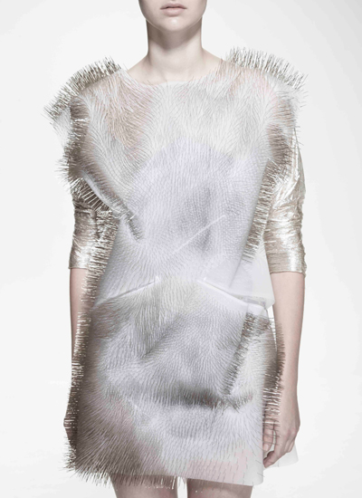

# persona-01

investigaciones individuales

## sobre adafruit i/o

En este proceso de aprendizaje trabajé con la plataforma Adafruit IO, una plataforma en la nube orientada al Internet de las Cosas (IoT), que permite conectar dispositivos físicos a internet para enviar, recibir y visualizar datos en tiempo real.

Mi objetivo fue aprender a conectar el Arduino Uno R4 WiFi a internet para enviar datos y controlarlos a través de dashboards.

### Proceso de instalación y configuración

Primero investigué qué era Adafruit IO y cómo funcionaba. Luego creé una cuenta y exploré la plataforma, donde aparecen los feeds y dashboards.

Después instalé el Arduino IDE, que es el programa que permite escribir y cargar códigos al Arduino.

### Pasos principales

- Seleccionar la placa: Arduino Uno R4 WiFi
- Abrir el administrador de bibliotecas
  
Instalar bibliotecas:
- Adafruit MQTT Library
- ArduinoHTTPClient
- Adafruit IO Arduino
  
Luego se configura el código agregando:
- Nombre y contraseña del WiFi
- Usuario de Adafruit IO
- AIO Key de Adafruit IO
  
Estos datos son importantes porque permiten que el dispositivo se conecte a la plataforma :)

Finalmente:

- Conecté el Arduino al computador
- Seleccioné el puerto correcto
- Subí el código

### Funcionamiento del sistema

El sistema funciona como una conexión entre el dispositivo físico y la plataforma digital.

Primero, el Arduino se conecta a una red WiFi, luego se autentica en Adafruit IO mediante el usuario y la AIO Key. Una vez conectado, se pueden enviar y recibir datos a través de los feeds.

Estos datos se visualizan en dashboards en tiempo real, lo que permite observar y manejar el sistema a distancia.

### Configuración de conexión y credenciales

Para que la conexión funcione, es necesario ingresar en el código los siguientes datos:

- Usuario de Adafruit IO
- AIO Key de Adafruit IO
- Nombre de la red WiFi 
- Contraseña de la red WiFi
  
Sin esta información, el dispositivo no puede conectarse ni enviar datos.

También es importante manejar estos datos con cuidado y no compartirlos públicamente!!!

### Uso de bibliotecas y comunicación

Con las bibliotecas utilizadas es posible:

- Conectar el dispositivo a internet
- Enviar datos a la nube
- Recibir información desde la plataforma
- Mantener la comunicación activa
  
Aunque internamente se utiliza el protocolo MQTT, este proceso se maneja de forma automática mediante las bibliotecas, lo que facilita el desarrollo.

### Funciones principales

Dentro del código se utilizan distintas funciones de la biblioteca de Adafruit IO que permiten gestionar la conexión y el envío de datos:

 `io.connect()` → establece la conexión inicial con Adafruit IO

`io.run()` → mantiene la conexión activa y gestiona la comunicación en tiempo real

`io.feed()` → define el canal por donde se envían los datos

`feed->save(valor)` → envía la información desde el dispositivo hacia la nube

### Conceptos básicos

### Feeds

Los feeds son espacios donde se almacenan los datos que envía el dispositivo, funcionando como contenedores de información.

### Datos

Son la información que se quiere guardar, como temperatura, humedad, encendido y apagado, etc.

### Dashboards

Los dashboards son paneles donde se pueden visualizar y controlar los datos.

- Feed: almacena datos
- Dashboard: visualiza datos
- WiFi: conecta el sistema

### Aprendizajes y dificultades

Aún me cuesta entender los errores del código porque no son claros para mí. También fue un poco confuso comprender cómo se conectan el Arduino, internet y la plataforma.

Con la práctica y el apoyo de tutoriales, logré entender mejor el proceso.

Aprendí a enviar datos en tiempo real por WiFi y comprendí que es muy importante configurar correctamente los datos para que todo funcione.

## sobre artista, diseñadora o producto que usa electrónica o computación inalámbricas

### Incertitudes – Ying Gao

En esta investigación analizo la obra Incertitudes de Ying Gao, una diseñadora que trabaja en la intersección entre moda, tecnología y arte interactivo. Su trabajo se caracteriza por integrar dispositivos electrónicos en prendas de vestir, generando una relación directa entre el cuerpo, el entorno y los sistemas tecnológicos.

### Sobre la diseñadora

Ying Gao es una diseñadora de moda radicada en Montreal y profesora en la Université du Québec à Montréal, con una trayectoria destacada en el diseño contemporáneo. Según su página web, “Ying Gao ha alcanzado distinción personal gracias a sus numerosos proyectos creativos presentados en más de cien exposiciones alrededor del mundo. Su variada obra creativa ha tenido cobertura mediática internacional…” (Gao, s.f.). Además, su trabajo propone una reflexión sobre la moda y su relación con el entorno, ya que “Ying Gao cuestiona nuestras suposiciones sobre la ropa combinando diseño de moda, diseño de producto y diseño de medios…” (Gao, s.f.).

### Obra

La obra Incertitudes (2013) consiste en una serie de prendas interactivas que reaccionan al sonido del espectador.

Como señala la diseñadora: “Este proyecto se basa en el concepto de incertidumbre. Activadas por la voz del espectador, las prendas reaccionan al sonido poniendo en movimiento los alfileres. A través de este movimiento, es como si la ropa entablara una conversación llena de incomprensión e incertidumbre con el espectador” (Gao, 2013).
Además: “Consiste en tela blanca y plateada cubierta con alfileres de modista, que sobresalen hacia fuera de la fachada textil… Su movimiento fluido genera un flujo ondulatorio, contrayendo y expandiendo todo el objeto portátil” (Azzarello, 2013).

- Video de la obra: <https://vimeo.com/73585344>

### Funcionamiento e interacción

El funcionamiento de la obra se basa en captar el sonido a través de la voz del espectador. Ese sonido es detectado por sensores y luego procesado por un sistema electrónico que activa el movimiento de los alfileres. Así, la prenda genera una respuesta en tiempo real y deja de ser algo estático, ya que interactúa directamente con lo que ocurre a su alrededor.

### Análisis conceptual

La obra se basa en el concepto de “incertidumbre”, lo que se refleja en su comportamiento cambiante e impredecible. La prenda no tiene una reacción fija, sino que depende de factores externos, lo que genera una interacción variable con el espectador.

Más allá de lo técnico, esto se puede interpretar como una representación de cómo funcionan muchas situaciones en la actualidad, donde no todo se puede controlar y las respuestas no son siempre predecibles.

### Relación con tecnología y diseño

El trabajo de Ying Gao mezcla distintas áreas como el diseño de moda, la electrónica, la interacción y los medios digitales. Esto muestra cómo la tecnología se puede integrar al diseño de forma creativa, no solo para que algo funcione, sino también para generar experiencias y transmitir ideas.

### Reflexión personal

Elegí a Ying Gao y su obra Incertitudes porque me gusta mucho lo que quiere representar, la inspiración que tiene y la forma en que lo transmite. Cambia bastante la idea tradicional del vestuario, ya que mezcla cuerpo, máquinas y diseño.

Me gusta cómo tiene una crítica más profunda y cómo muestra que hoy todo es rápido e inestable, reflejándolo en la ropa, que siempre está cambiando y no se sabe cómo va a reaccionar, igual que en la vida, donde no todo se puede controlar.

Recomiendo mucho ver sus otras obras :)  https://yinggao.ca/

### Referentes extra

También encontré artistas en Spotify que me parecieron interesantes:

- Holly Herndon – <https://open.spotify.com/intl-es/artist/2c9yn5DJQd5es7YMY92ikZ>
  
Usa una IA creada por ella y su equipo para hacer música, donde la voz y los datos se transmiten y procesan digitalmente.
- Ryoji Ikeda – <https://open.spotify.com/intl-es/artist/5y835stYdAVOoNOq5EBMxz>
  
Hace música con datos y señales digitales, mostrando cómo la información se transmite y se convierte en sonido.

### Bibliografía

- Azzarello, N. (2013). Ying Gao’s sound activated kinetic garments: Incertitudes. Designboom. <https://www.designboom.com/design/ying-gaos-sound-activated-kinetic-garments-incertitudes/>

- Gao, Y. (2013). Incertitudes. <https://vimeo.com/73585344>

- Gao, Y. (s.f.). Incertitudes (Interactive project). <https://yinggao.ca/interactifs/incertitudes/>

- Gao, Y. (s.f.). Profile. <https://yinggao.ca/info/profile/>

- MKElectronica. (s.f.). Aprende a utilizar la plataforma Adafruit IO. <https://mkelectronica.com/?s=Aprende+a+utilizar+la+plataforma+Adafruit+IO>
