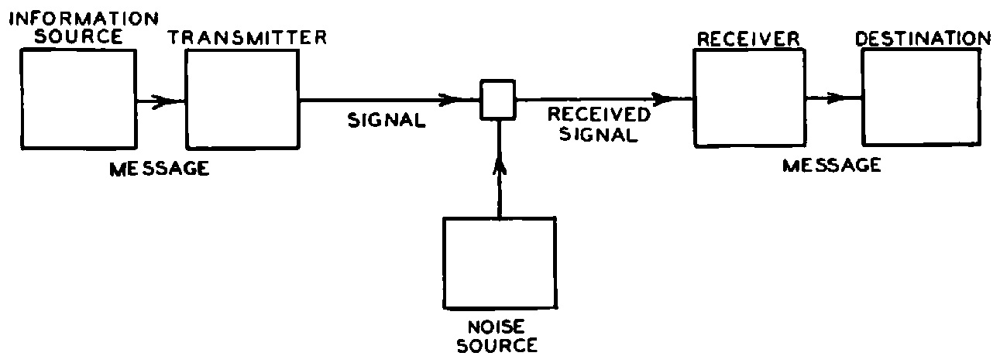
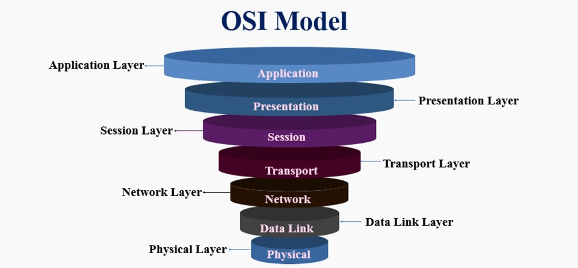

# sesion-04

lunes 30 marzo 2026

las raspberry se conectaras siempre a la misma ip

Sch raspi 

Sudo: super user do

No copiar comandos de internet, porque hay gente mala que crea comandos que destruyen tu computador

cambiar nombre del Arduino al nombre del grupo y todos usar la misma clave

En línea 75 y 76 poner nombres del grupo y contraseña

El broker vive en la rapberrypi del profe

Bug: se llama bug porque se metió una polilla dentro de un computador que interrumpía 

empezar a investigar cómo crear códigos y preguntar bien a la ia que poder hacer 

⅞ pasos

Claude shannon la teoría de la información, describir cómo elementos se pueden comunicar 

modelo osi

