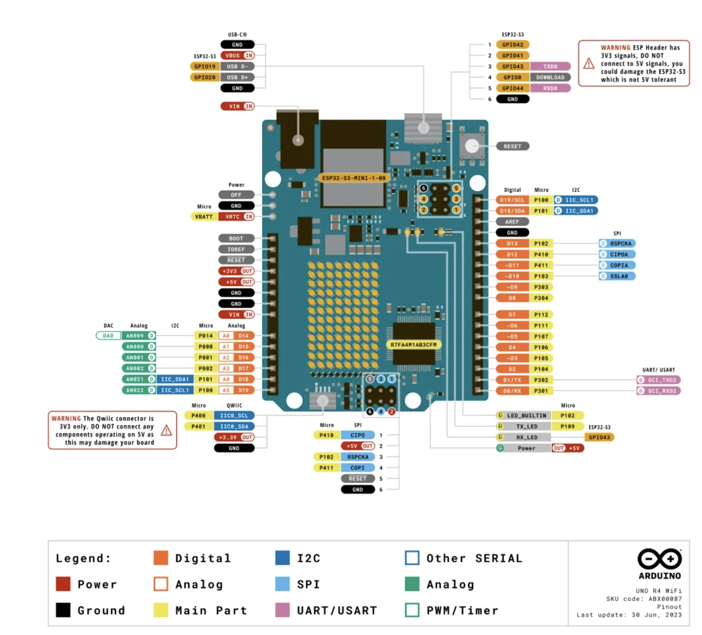

# sesion-06

lunes 13 abril 2026

## Apuntes

Componentes:

- resistencia
- consensador -> capacidad electrica
- capacitor -> lo que varia es la capacitancia

### Sensor capacitivo

Los sensores capacitivos reaccionan ante metales y no metales que al aproximarse a la superficie activa sobrepasan una determinada capacidad.

- `Capacitive touch:` La detección capacitiva es una tecnología que detecta cambios en la capacitancia para determinar la presencia o ausencia de un objeto conductor, como un dedo humano. Este principio se utiliza ampliamente en dispositivos táctiles.
  
- Librería a utilizar: `Arduino_CapacitiveTouch` library documentation.

- `CapacitiveTouch(uint8_t pin)`: Sirve para crear el sensor táctil capacitivo y decirle en qué pin está conectado.
- `bool begin()`: Configura internamente el pin y deja listo el hardware para empezar a leer.

Vuleve a `true` si todo funciona bien, vuelve a `false` si hubo un problema.
  
- `int read()`: Lee el valor crudo del sensor.
- `bool isTouched()`: Detecta si el sensor está siendo tocado.
- `void setThreshold(int threshold)`: Define el nivel mínimo para considerar que hay un toque.
- `int getThreshold()`: Obtiene el umbral actual.
- D0 -> digital 0

### Código visto enclases

Antes de ver el código revisamos los pinouts del Arduin r4 minima wifi



imágen sacada de: <https://www.geekfactory.mx/producto/arduino-uno-r4/?srsltid=AfmBOoqRndkhqJ8yTG48xPUQ-dplEwDLJpbTxowiNFoIRZPJXGhD-76m>

Tutorial de UNO R4 Capacitive-Touch, comentado en clases por Aarón.


#### Ejemplo 1

```cpp
#include <Arduino_CapacitiveTouch.h>


// referencia
// https://docs.arduino.cc/tutorials/uno-r4-wifi/touch/
// por montoyamoraga para disenoUDP
// dis9079
// abril 2026
// funciona con Arduino Uno R4
// wifi o minima
// usar biblioteca Capacitive_Touch

// importar biblioteca
#include "Arduino_CapacitiveTouch.h"

// existe un constructo
// del tipo CapacitiveTouch
// que se llama touchButton, ese nombre es de fantasia
// esta conectada a la patita D0
CapacitiveTouch touchButton = CapacitiveTouch(D0);

// valor de lectura
int valorLectura = 0;

// setup() ocurre al principio una vez
void setup() {
  // prende el puerto serial
  // la velocidad es importante
  Serial.begin(9600);

  // touchButton
  // despues viene un punto
  // ese punto es como hacer doble click
  // es como entrar
  // dentro hace begin() que lo inicializa
  // el if hace que si lo logra pase algo
  // y si no, pase otra cosa
  if(touchButton.begin()){
    Serial.println(":) yay");
  } else {
    Serial.println("oh no :'( snif");
    // quedarse pegado ante el fracaso
    while(true);
  }
  
  // define el umbral o threshold
  // en 2000
  // lo que de inmediato me hace preguntarme
  // oh no
  // cuanto es el valor minimo posible
  // cuanto es el valor maximo posible
  // cuando terminara este calvario
  // por que 2000?
  // en california funciona?
  // y en este frio otono de santiago
  // que hago
  // quien soy
  // etc
  touchButton.setThreshold(2000);
}

// loop() ocurre en bucle
// despues de setup()
// hasta el fin de los tiempos
void loop() {

  // asignar a valorLectura
  // el resultado de preguntarle a touchButton
  // cuanto vale
  // read() me da el valor crudo
  valorLectura = touchButton.read();
  Serial.print("Valor crudo: ");
  // imprime valor lectura
  Serial.println(valorLectura);


  // se pregunta con if
  // si el boton esta siendo tocado
  if (touchButton.isTouched()) {
    // si lo esta, imprime
    Serial.println("hubo contacto");
  }
  
  // deja tu vida atras
  // suspendela, en pausa
  // cierra los ojos por 100 ms = 0.1 s
  // ignora todo lo que esta pasando
  // para que no ocurra tan rapido todo
  delay(100);
}
```
#### Ejemplo calibrado 

```cpp
#include <Arduino_CapacitiveTouch.h>


// referencia
// https://docs.arduino.cc/tutorials/uno-r4-wifi/touch/
// por montoyamoraga para disenoUDP
// dis9079
// abril 2026
// funciona con Arduino Uno R4
// wifi o minima
// usar biblioteca Capacitive_Touch

// importar biblioteca
#include "Arduino_CapacitiveTouch.h"

// existe un constructo
// del tipo CapacitiveTouch
// que se llama touchButton, ese nombre es de fantasia
// esta conectada a la patita D0
CapacitiveTouch touchButton = CapacitiveTouch(D0);

// valor de lectura
int valorLectura = 0;

// valores min y max
// que partan en el peor caso posible
int minLectura = 100000;
int maxLectura = 0;


// setup() ocurre al principio una vez
void setup() {
  // prende el puerto serial
  // la velocidad es importante
  Serial.begin(9600);

  // touchButton
  // despues viene un punto
  // ese punto es como hacer doble click
  // es como entrar
  // dentro hace begin() que lo inicializa
  // el if hace que si lo logra pase algo
  // y si no, pase otra cosa
  if (touchButton.begin()) {
    Serial.println(":) yay");
  } else {
    Serial.println("oh no :'( snif");
    // quedarse pegado ante el fracaso
    while (true)
      ;
  }

  // define el umbral o threshold
  // en 2000
  // lo que de inmediato me hace preguntarme
  // oh no
  // cuanto es el valor minimo posible
  // cuanto es el valor maximo posible
  // cuando terminara este calvario
  // por que 2000?
  // en california funciona?
  // y en este frio otono de santiago
  // que hago
  // quien soy
  // etc
  touchButton.setThreshold(2000);
}

// loop() ocurre en bucle
// despues de setup()
// hasta el fin de los tiempos
void loop() {

  // asignar a valorLectura
  // el resultado de preguntarle a touchButton
  // cuanto vale
  // read() me da el valor crudo
  valorLectura = touchButton.read();

  // actualizar valores min y max
  if (valorLectura < minLectura) {
    // actualiza el minimo con uno mejor
    minLectura = valorLectura;
  }

  if (valorLectura > maxLectura) {
    // actualizar el maximo con uno mejor
    maxLectura = valorLectura;
  }


  Serial.print("Valor crudo: ");
  // imprime valor lectura
  Serial.println(valorLectura);

  Serial.print("min: ");
  Serial.print(minLectura);
  Serial.print(", max: ");
  Serial.println(maxLectura);


  // se pregunta con if
  // si el boton esta siendo tocado
  if (touchButton.isTouched()) {
    // si lo esta, imprime
    Serial.println("hubo contacto");
  }

  // usar mi min y max para tomar conclusiones
  // tomo el valor promedio entre min y max
  // y si mi valor actual es mayor que eso
  // digo oh estoy por sobre el promedio
  if (valorLectura > (minLectura + maxLectura)/2) {
    Serial.println("sobre el promedio, dab");
  }

  // deja tu vida atras
  // suspendela, en pausa
  // cierra los ojos por 100 ms = 0.1 s
  // ignora todo lo que esta pasando
  // para que no ocurra tan rapido todo
  delay(100);
}
```

### Documentación


Información sacada de: <https://docs.arduino.cc/tutorials/uno-r4-wifi/touch/>
