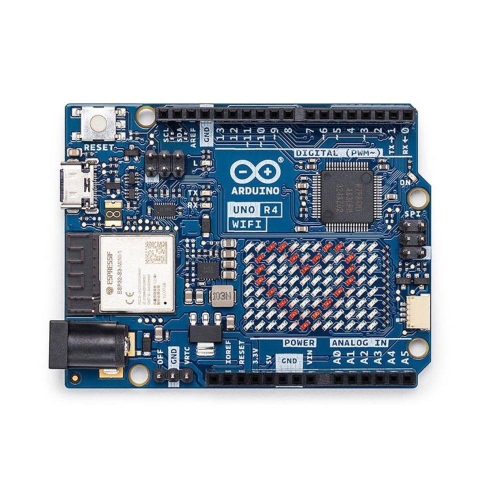

# sesion-02 16.03

Grupo de 3: Paredes, Parada, Caurapán. ;)

## Github

- Descargar la app (fácil de consumir)
- [MarkDown](https://docs.github.com/en/get-started/writing-on-github/getting-started-with-writing-and-formatting-on-github/basic-writing-and-formatting-syntax) un lenguaje diseñado para escribir, formatear y jerarquizar texto de forma rápida.

**Open source:** Fuente abierta
- <https://oshwa.org> Según Gemini: Open Source Hardware Association (OSHWA) es una organización sin fines de lucro dedicada a promover el hardware de código abierto (oSHW). Actúa como un núcleo para la comunidad, fomentando la accesibilidad, colaboración y el respeto por la libertad del usuario en el diseño tecnológico, incluyendo la certificación oficial de hardware.

## Arduino
Boards Manager: R4, convierte código en 01's
Bibliotecas: MQTT

instalar 3 herramientas:

1. Boards Manager -> Arduino Uno R4 Boards (v1.5.3 o más reciente)
2. Library Manager -> ArduinoMQTTClient (v0.1.8 o más reciente)
3. Library Manager -> ArduinoGraphics (v1.1.4 o más reciente)

usaremos la palabra Arduino para referirnos a 3 cosas distintas:

1. la placa de desarrollo.
2. el software Arduino IDE, donde escribiremos el código que correrá en la placa.
3. el lenguaje de programación, que es un dialecto del lenguaje C++.

## Visual Studio Code

instalar Visual Studio Code, un editor de código más avanzado, disponible en <https://code.visualstudio.com/>

**Lenguaje de versiones:** 0.1.8
- **Primero:** cuando hacen cambios tan grandes que no son compatibles con la versión anterior.
- **Segundo:** Cuando se hacen cambios que son aun compatibles con la versión anterior.
- **Tercero:** Cuando avanzan/se arreglan cosas.

### Arduino UNO R4 WIFI
- Placa
- Software (editor)
- Lenguaje

- esta placa es una nueva versión del **Arduino Uno R3**, lanzado en 2011, y se convirtió en un estándar en la enseñanza y prototipado de proyectos de computación física, usa el chip ATMEGA328P.
- la placa **Arduino Uno R4 WiFi** fue lanzada el año 2023, tiene varias mejoras como la inclusión de WiFi, conector USB-C, un procesador más potente del fabricante Renesas, y también incluye una pequeña pantalla de 12 x 8 pixeles.

- **Setup:** instrucciones
- **Loop:** Repite infinito

**mosquitto** es un broker (intermediario) de MQTT, que se encarga de recibir y distribuir mensajes entre clientes MQTTT.

**MQTT:** (Message Queuing Telemetry Transport) es un protocolo de mensajería ligero, de código abierto y basado en el modelo publicación-suscripción, diseñado para comunicación máquina a máquina (M2M) y el Internet de las Cosas (IoT). Funciona bajo TCP/IP y es ideal para dispositivos con recursos limitados, bajo ancho de banda o redes inestables.

Broker: Los numeritos del wifi 
Port: 1883

#### Solemne 1

Conectar Dos placas distintas.
