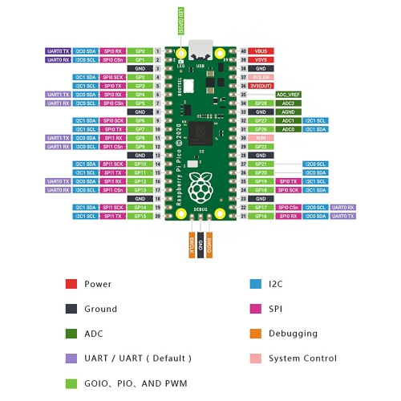
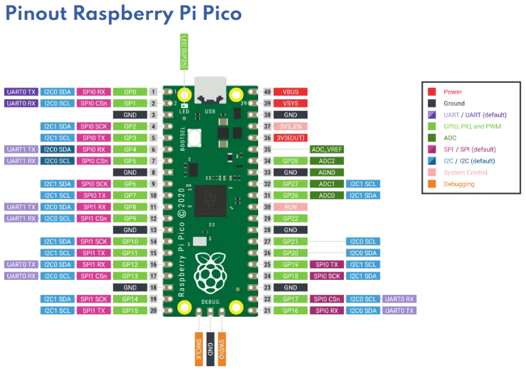
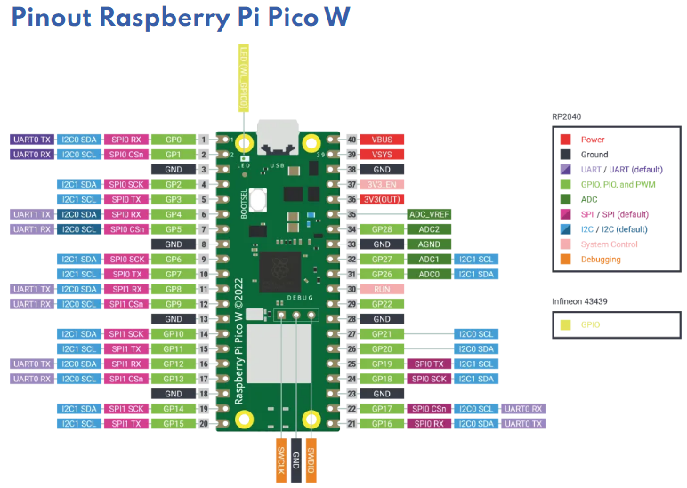

# sesion-08

lunes 27 abril 2026

## Raspberry Pi Pico

Es una económica placa de microcontrolador diseñada por la Fundación Raspberry Pi. Ideal para principiantes y expertos, es perfecta para robótica, IoT y domótica

- Las personas crearon MicroPython y nadie lo usó
- CircuitPython es un lenguaje de programación diseñado para simplificar la experimentación

> Link de descarga https://circuitpython.org/board/raspberry_pi_pico/ (lo pongo para poder descargarlo desde mi otro compu XD)

Por lo que veo de otros compañer@s de clase, hay que inyectarlo a la Raspberry

descargando estas bibliotecas:

- adafruit_minimqtt
- adafruit_connection_manager.mpy
- adafruit_ticks.mpy

nos vemos a la vuelta del receso
