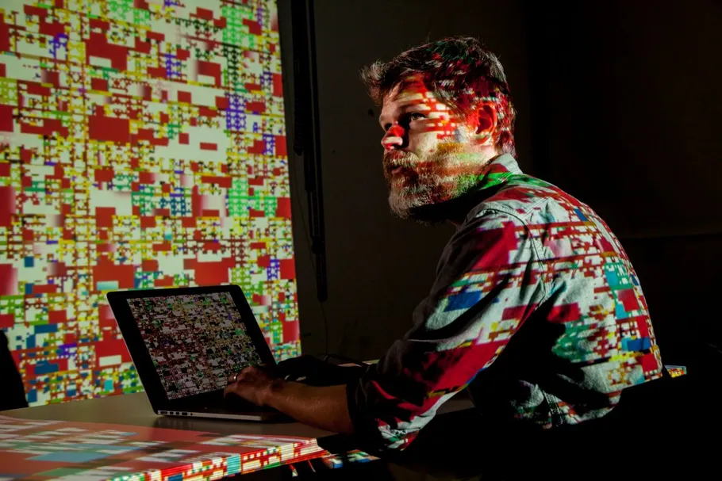
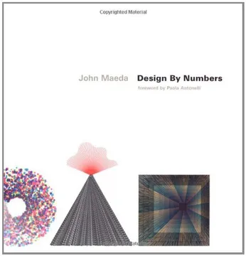
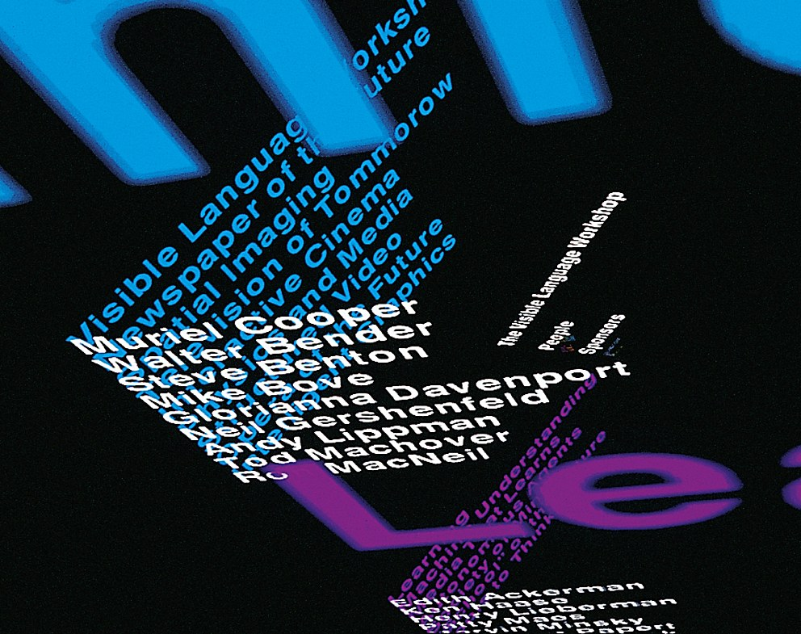
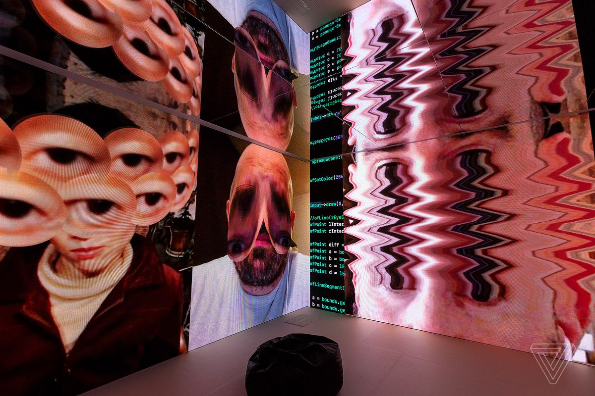
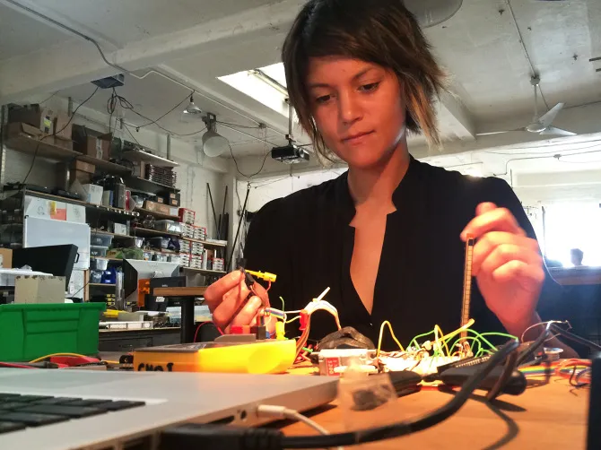
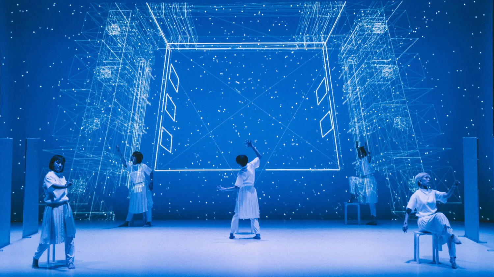

# sesion-01

lunes 09 marzo 2026

<h1 align="center"> Interacciones Inalambricas </h1>

### Cassey Reas

>Artista visual conocido como el co-creador del lenguaje de programación **Processing**, que revolucionó el acceso al código dentro del mundo creativo. Su obra va principalmente sobre el arte generativo, donde utiliza algoritmos y sistemas, transformándolos en visuales dinámicas. A través de su obra y su labor docente, Reas ha sido fundamental para consolidar el software no solo como una herramienta de producción, sino como un medio expresivo y poético en el arte contemporáneo.

### John Maeda

>Diseñador y artista, pionero en el diálogo entre el diseño y la computación. Fue presidente de la **Rhode Island School of Design** (RISD), una de las mejores escuelas y fue profesor en el MIT Media Lab, fundó el grupo de investigación Aesthetics and Computation, donde desarrolló el proyecto Design By Numbers, el objetivo del software era facilitar el proceso de aprendizaje de programación para artistas y diseñadores.

### Muriel Cooper
>Madre del diseño gráfico y pionera de la computación visual, reconocida por ser la cofundadora del **Visible Language Workshop** en el **MIT**. La primera persona en llevar los principios del diseño tipográfico y la arquitectura de la información al entorno digital en 3D. Su trabajo fue fundamental para humanizar la interfaz hombre-máquina, demostrando que el código podía ser fluido, elegante y visualmente sofisticado mucho antes de que existieran las herramientas de diseño modernas.

### Zach Lieberman
>Artista digital y diseñador, su obra va del arte interactivo, la programación y análisis de datos. Es conocido por ser uno de los creadores de openFrameworks, una biblioteca de código abierto para la programación creativa y cofundador de la School for Poetic Computation en Nueva York.

>Utiliza Processing

### Lauren Mcarthy

>Artista y programadora, creadora de p5.js, herramienta para aprender código y hacer arte, su obra explora las interacciones sociales reflejadas en el algoritmo, vigilancia y automatización, mediante su propio cuerpo y vida, a través de proyectos que fusionan el software con la performance, McCarthy cuestiona cómo la tecnología moldea nuestras relaciones humanas y nuestra identidad.

### Kyle McDonald

>Artista y programador que trabaja en la mezcla de la visión artificial y el arte interactivo, exploran las relaciones entre los seres humanos y los algoritmos a través de instalaciones, su obra aborda la vigilancia y la automatización, a menudo bajo código abierto.
>Colaborador de OpenFrameworks.

### Maria Jose Contreras

>Artista chilena, su obra trata de la mezcla de la performance, el activismo y los estudios del cuerpo.

----

### Touch OSC
>App de conexiones inalámbricas para dispositivos móviles
>Se puede interactuar con software de música, audio y multimedia
>Usa __Open Sound Control (OSC)__

### OSC
-Open Sound Control es un sintetizador y sistema de audio

### IOT
-Internet Of Things, se refiere a la conexión de objetos físicos a internet

### MQTT
-Protocolo que tiene la posibilidad de publicar y subscribir

----

### Arduino

-Empresa italiana
-Physical computing (interacciones a través de hardware y software)
-Microcontroladores
-trabajaremos con __Arduino UNO R4 WIFI__

## Hernan Barragan

-Diseñador Latinoamericano desarrollador de __Wiring__, de código abierto
-Idea fue robada y se creó __Arduino__

### Raspberry Pi Pico
- __Tasty Chip__; instrumento hecho con computador Raspberry
 

