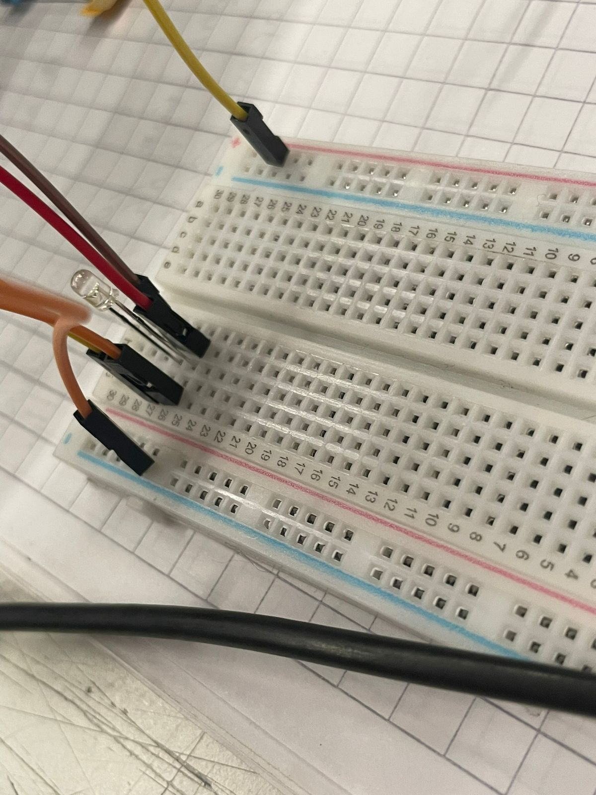
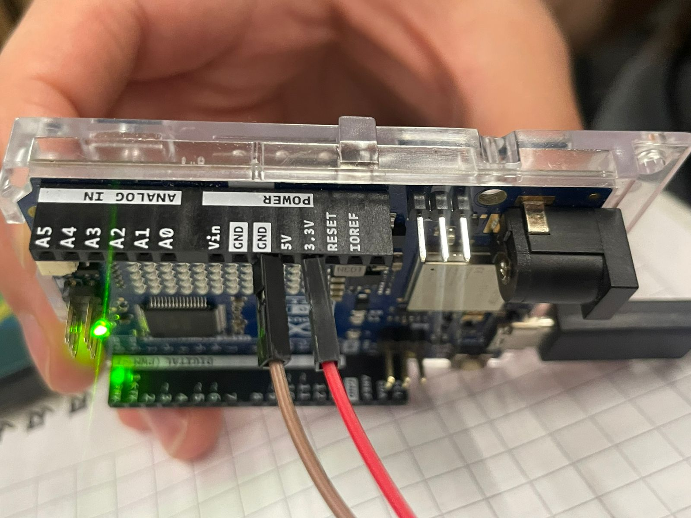

# sesion-05

Lunes 06 abril 2026
La clase de hoy fue más de investigar sobre las interacciones que queremos experimentar en nuestras solemnes, partiendo la clase logrando conectar nuestro Arduino a la nube de Adafruit IO, luego decidimos seguir investigando sobre como conectar y controlar un LED desde Arduino y de intermediario el Feed de Adafruit IO que es donde se realiza la conexion y el Dashboard que es donde se puede manipular las interacciones como apagar y encender o contar datos.
Leímos y seguimos un tutorial de Adafruit para eso, pero no lo logramos hacer.

https://learn.adafruit.com/adafruit-io-basics-esp8266-arduino/example-sketches

Aun así fuimos por 1 pin LED, hartos cables y 1 OHM resistor de 220.
Comenzamos a hacer las conexiones con ayuda de algunos compañeros que nos fueron orientando en como ir poniendo los componentes entre el Arduino y la protoboard, y logramos hacer que se prendiera la luz, pero se quedaba estática solamente, y hasta ahí llegamos durante la jornada.

