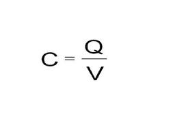

# sesion-06

lunes 13 abril 2026

La primera mitad de la clase se realizó una explicación de como leer el Excel de la revisión de la solemne 01 y se nos dio el tiempo para realizar correcciones y se explicó el proceso que se viene dentro de estas semanas hasta la solemne dos 
En esta ocasión habrá que ponerle énfasis en lo "poético" de la entrega acompañada de una presentación oral acompañada con el github grupal.

-Para el examen se tendrá que hacer la conexión entre dos edificios.

## Materia

### Capacitancia

"Se refiere a la capacidad de un componente, conocido como condensador o capacitor, para almacenar una carga eléctrica. La capacitancia se mide en faradios (F) y es una propiedad que determina la cantidad de carga que un capacitor puede almacenar por unidad de voltaje aplicado."
redeweb.com/en/actualidad/que-es-la-capacitancia/

-El dispositivo para tenerla se llama condensador.
En ingles se le dice capacitor que es la misma palabra para las dos.

-Área definida pero distancia variable.

-Usar capacitancia como forma de medir distancias.

-En el manual de Arduino R4 WIFI, podremos ver que se puede hacer una salida de audio y un sensor capacitivo de audio.

-Biblioteca **arduino_capacitiveTouch Library** tutorial:
https://docs.arduino.cc/tutorials/uno-r4-wifi/touch/

-#include arduino capacitive.touch, se puede leer y encontrar en la biblioteca.
-"Quiero usar esta biblioteca en este codigo".

-Touch button, es como hacer doble click o entrar, dentro hace begin es decir inicializa.
-El "if" hace que si no lo logra realizar la tarea, pasa alguna acción en específico.
 
### While (true)

>"Ejecuta este código una y otra vez, para siempre, porque la condición siempre es verdadera".

### Loop

>Repetir un bloque de código varias veces sin tener que escribirlo una y otra vez.

### Int sensorvalue

>Int: el tipo de dato: número entero
>SensorValue: el nombre de la variable, usada típicamente para guardar la lectura de un sensor.

>Si está entre comillas se imprime lo que dice tal cual, si no las tiene se imprime el valor que da.

>No es necesario que el PC tenga el mismo internet que el Arduino en el config.

### Valor crudo

>Es el dato directo que entrega el sensor, sin ningún procesamiento. Es un número que el hardware devuelve tal cual, es una representación digital de un voltaje eléctrico.

### Valor de lectura

>Es el valor crudo convertido a algo útil (temperatura, distancia, voltaje, etc.)

### If

>Es una estructura de control que ejecuta código solo si se cumple una condición.

---
### Theremin 

Uno de los primeros instrumentos musicales electrónicos, inventado en 1920 por Lev Sergevich Termen, doble espía. Funciona con capacitancia, mediante dos antenas que detectan la posición de las manos del intérprete, una controlando la frecuencia y el volumen, mientras más lejos este la mano más fuerte es.

Basta con dos censores capacitivos para hacer funcionar un Theremin.

>Martín Benavides experto en Theremines.

>Robert Moog patento el Theremin.

